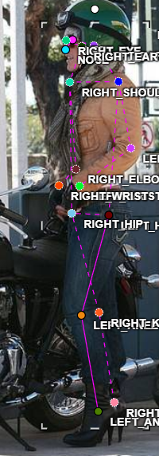
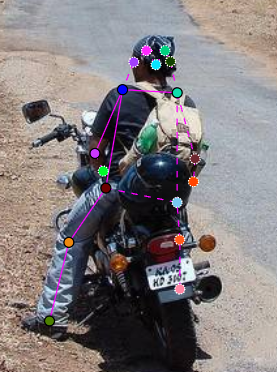
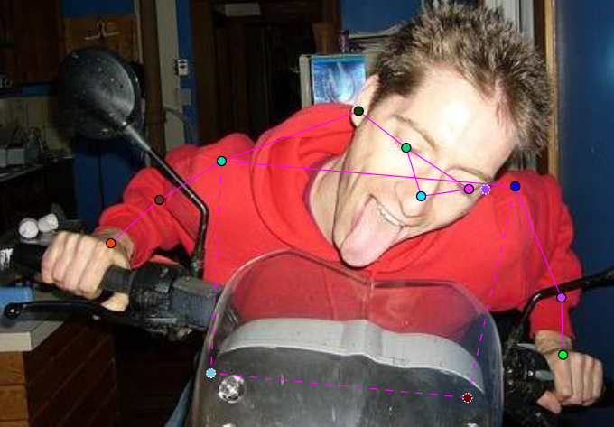
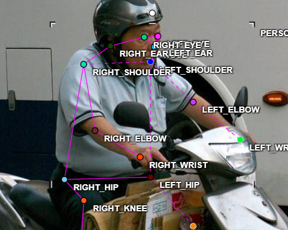
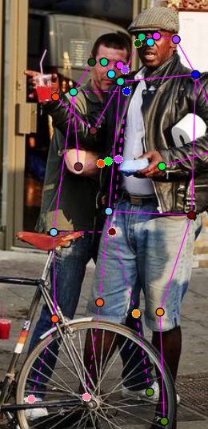

# Mini guideline - nhóm: 45  |  người gán: Trần Đăng Ka Song  |  ngày: 16/9/2026

> Điền file này **trong lúc** gán nhãn, không phải sau khi xong. Mỗi lần bạn dừng lại
> hơn 10 giây để phân vân, đó là một dòng phải ghi vào đây.

## 1. Luật bắt buộc (đã thống nhất cả lớp - không sửa)

- Bộ 17 điểm COCO, đúng tên, đúng thứ tự. Lấy từ file `.SVG` chung.
- Mọi người trong ảnh đều có **đủ 17 điểm**. Điểm không dùng được thì gắn cờ, không xoá.
- Trái/phải tính theo **cơ thể người**, không theo bức ảnh.
- Bị che, còn trong khung -> `v = 1`, **vẫn đặt chấm** ở vị trí ước lượng.
- Ra ngoài mép ảnh -> `v = 0`, **không** đặt chấm.
- Không dùng `Hidden` (`h`) - nó không được lưu vào file.

## 2. Luật của nhóm bạn (phải điền)

| Tình huống | Luật nhóm bạn chọn | Vì sao |
| --- | --- | --- |
| Hông của người mặc quần áo dài | Nếu có một phần hông nhìn thấy → gán v=1, nếu hoàn toàn bị che → v=0 |  | 
| Tai bị tóc hoặc mũ bảo hiểm che một phần | Nếu chỉ một phần tai nhìn thấy → gán v=1; nếu không thấy phần nào → không gán (v=0) |  
| Người bị cắt ở mép ảnh (chỉ thấy từ hông trở lên) | Các keypoint nằm ngoài khung ảnh luôn gán v=0 | 
| Cổ tay nằm sau tay lái / sau thân mình | Nếu một phần cổ tay còn trong khung → gán v=1; nếu hoàn toàn ra ngoài → v=0 | 
| Hai người chồng lên nhau | Xác định người chính (có phần cơ thể rõ nhất) và gán v=1 cho các keypoint nhìn thấy; những keypoint của người phụ bị che hoàn toàn → v=0 | 
| Người nhỏ đến mức nào thì không gán nữa | Khi người chiếm <5% diện tích ảnh và không có ít nhất 5 keypoint v=2, không gán (v=0) | 

Với mỗi luật, chèn **một ảnh mẫu** (screenshot từ CVAT) thay vì chỉ viết một câu.
Slide 12 nói rõ: khớp không có bề mặt nhìn thấy được thì phải có ảnh mẫu, không phải
một câu văn chung chung.

## 3. Ba ca mơ hồ đã gặp (bắt buộc, ghi ít nhất 3)

### Ca 1 – train_04.jpg, người #1, khớp left_wrist

Mơ hồ: khớp nằm trong vùng tay lái, khó quyết định v.
Quyết định: gán v=1 vì có một phần tay hiển thị.
Vì sao: dựa trên phần tay bên trái còn nhìn thấy.
Nếu người khác gán v=0 → model sẽ học bỏ sót khớp quan trọng.

### Ca 2 - ảnh `train_13.jpg`, người thứ `0`, khớp `right_hip`

Mơ hồ: hip bị áo dài che hết.
Quyết định: không gán (v=0).
Vì sao: không có dấu hiệu nào của hip trong ảnh.
Nếu người khác gán v=1 → model sẽ học “phạt hiện” hip không tồn tại.

### Ca 3 - ảnh `train_15.jpg`, người thứ `2`, khớp `right_ear`

Mơ hồ: tai bị mũ bảo hiểm che một phần.
Quyết định: gán v=1 vì một phần tai vẫn nhìn thấy.
Vì sao: dựa trên hình dạng nón cho biết vị trí tai.

## 4. Sau khi so visibility report với bạn cùng nhóm

Khớp lệch %v=1 nhiều nhất: left_ear (bạn = 9 % / họ = 18 %).
Nguyên nhân: guideline chưa rõ về việc “có một phần bị che nhưng vẫn gán v=1”.
Luật mới đã thêm vào mục 2: Nếu chỉ một phần nhỏ của keypoint được nhìn thấy, gán v=1; nếu không thấy gì, gán v=0.